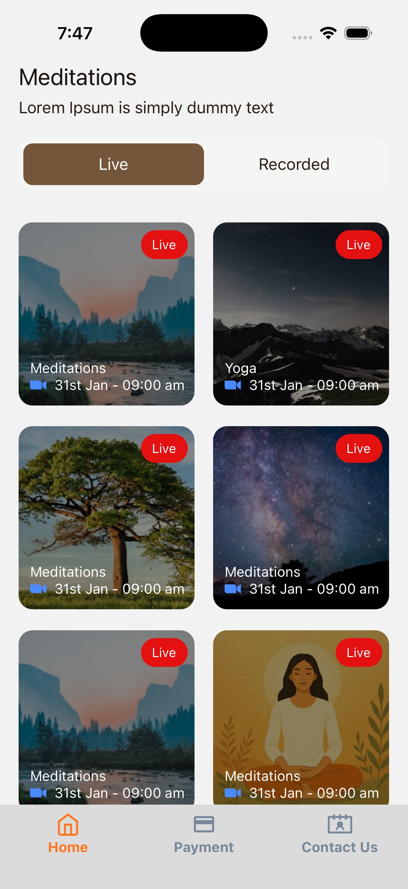
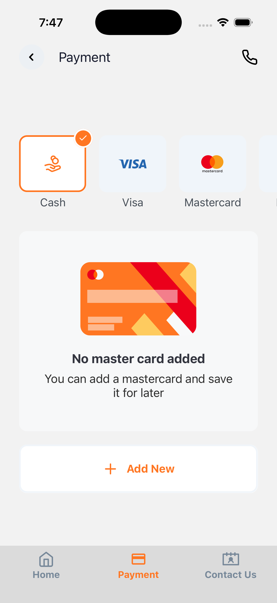

[UiMastering] - Responsive React Native UI Mastery (TypeScript)

## 📌 Project Overview
A specialized solo project focused on Responsive Design and High-Fidelity UI. Leveraging my background in Native Android development, I built this app to demonstrate how to achieve pixel-perfect layouts across diverse screen sizes using React Native and TypeScript.

## 📱 App Screenshots
Using **react-native-size-matters**, the UI maintains a consistent aspect ratio across various screen densities.

| Home Screen | Payment Screen | Contact Screen |
| :---: | :---: | :---: |
|  |  |  |
| *Responsive Layout* | *TSX-based UI* | *SVG Integration* |
<br />

## 🚀 UI & Engineering Highlights
*   **Responsive UI Architecture**: Integrated `react-native-size-matters` to implement a scalable layout system, ensuring UI consistency across diverse Android and iOS device densities.
*   **TypeScript Mastery**: Developed the entire UI using **.tsx** components with strictly defined interfaces for props, ensuring enterprise-grade type safety.
*   **SVG & Vector Graphics**: Implemented a modern asset pipeline using **SVG icons** for crisp, resolution-independent visuals.
*   **Complex Navigation**: Architected a professional hierarchy featuring **Bottom Tab Navigation** for core app modules and **Top Tab Navigation** for categorized sub-views.
*   **Custom UI Architecture**: Developed a library of **Reusable Components** using StyleSheet for optimized, native-like rendering performance.
*   **Data Simulation**: Engineered a local **Data-Fetching** layer to simulate real-world API responses using static JSON assets.
*   **State Orchestration**: Managed **UI States** (loading, active tabs, form inputs) using React Hooks to ensure a responsive user experience.

## 📂 Folder Structure
```
src/
 ├── assets/          # Static assets (Images, Icons in .tsx format)
 ├── components/      # Reusable UI building blocks with TS Props
 ├── navigation/      # Bottom Tabs & Top Tabs configuration
 ├── screens/         # Main Views:
 │    ├── Intro/      # Loading view
 │    ├── Home/       # Main Dashboard
 │    ├── Payment/    # Transaction & Checkout UI
 │    └── Contact/    # Support & User Info
 ├── data/            # Local JSON files for data fetching
```
